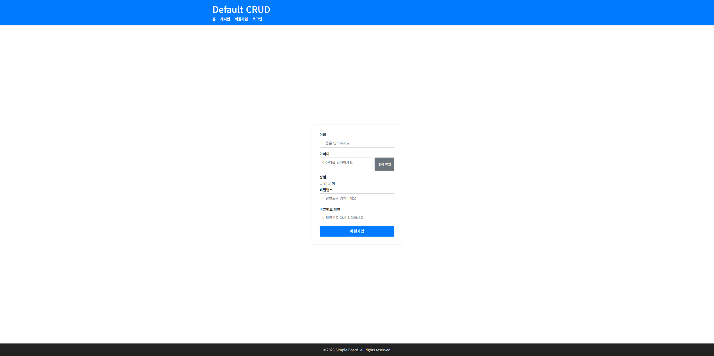
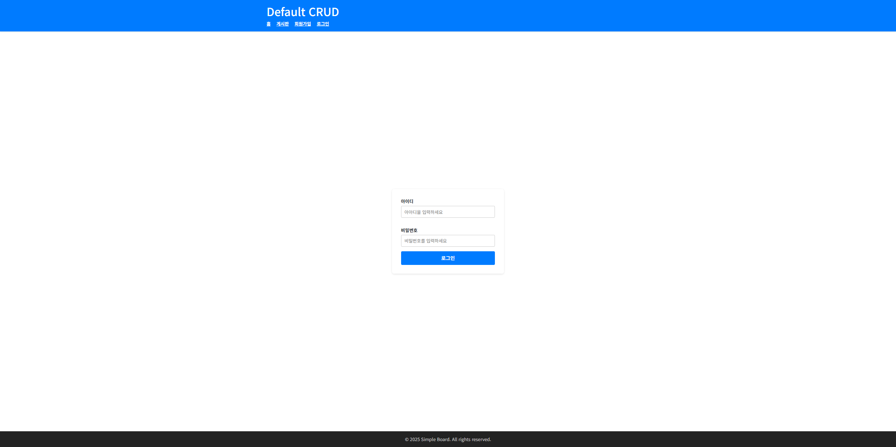
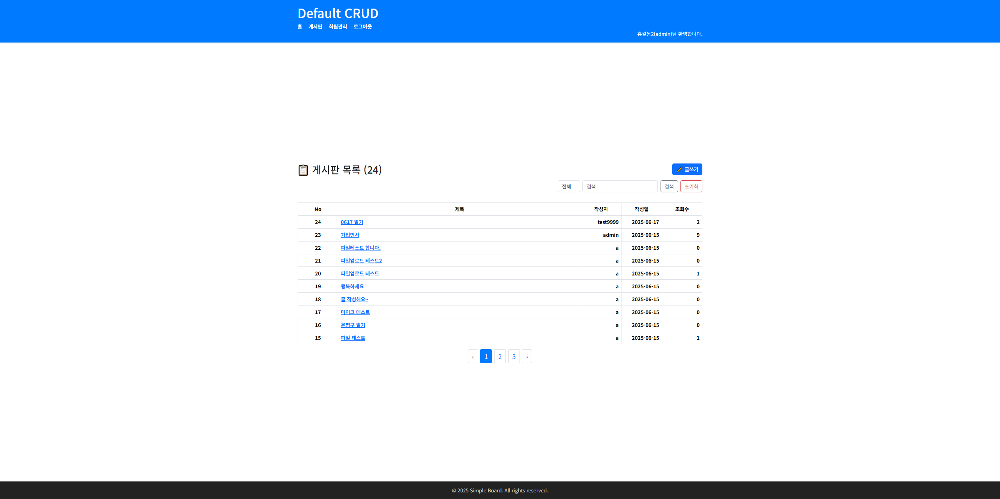
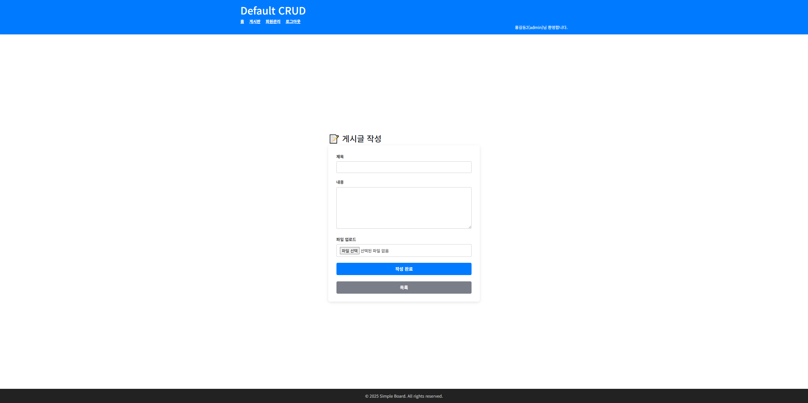
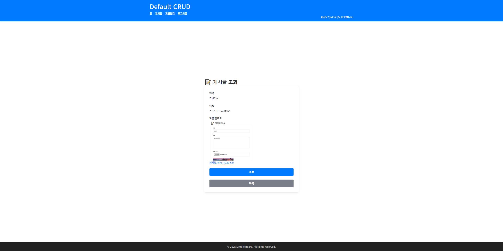
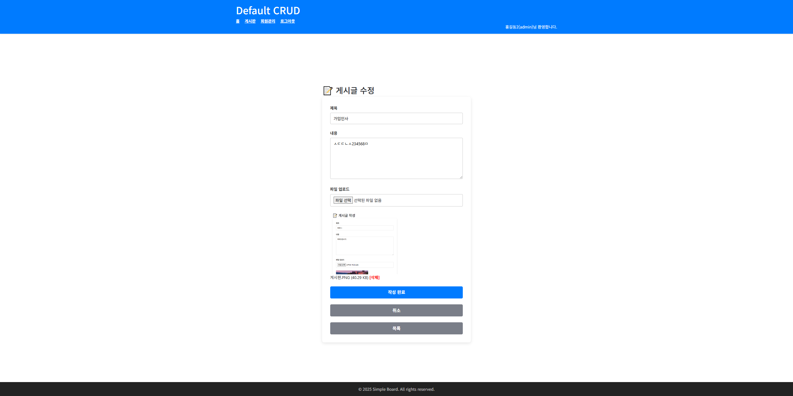
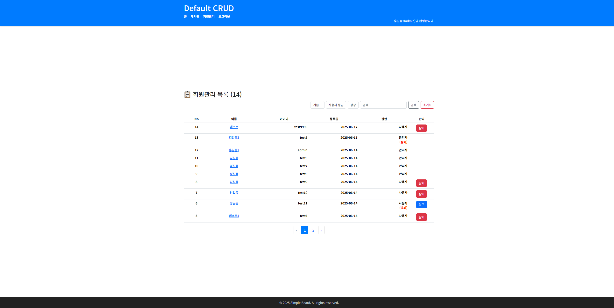
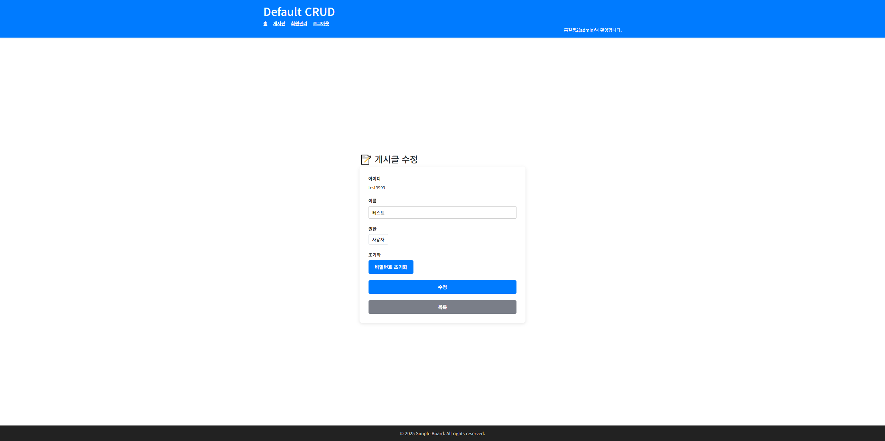

<h1> 라라벨 CRUD</h1>

 php 8.1, laravle 10.10, mysql 8.0.28

게시판 및 회원가입

 
    기능 설명  
    &nbsp; 0. 메인페이지  
    &nbsp; 1. 회원가입, 로그인  
    &nbsp; 2. 게시판  
    &nbsp; 3. 관리자  
    기능 세부 설명  
    &npsp;0. 메인페이지 
    &nbsp; 1. 회원가입, 로그인  
    &nbsp;&nbsp;1.1 로그인과 로그인에 대한 로그 생성  
    &nbsp;&nbsp;1.2 사용자와 관리자 구분 설정  
    &nbsp;&nbsp;1.3 회원 이름 및 비밀번호 초기화  
    &nbsp;&nbsp;1.4 회원 정상 or 회원 탈퇴 처리  
    &nbsp;2. 게시판  
    &nbsp;&nbsp;2.1 글쓰기 (게시글 작성 및 파일업로드)  
    &nbsp;&nbsp;2.2 상세조회(게시글 조회 및 파일다운로드)  
    &nbsp;&nbsp;2.3 게시글 수정(게시글 수정 및, 파일업로드 및 삭제)  

    작업 캡처 파일  
    &nbsp; 1. 메인페이지  
      
    &nbsp; 2. 회원가입  
      
    &nbsp; 3. 로그인  
      
    &nbsp; 4. 게시판 목록  
      
    &nbsp; 5. 게시판 등록  
      
    &nbsp; 6. 게시판 상세조회  
      
    &nbsp; 7. 게시판 수정  
      
    &nbsp; 8. 회원정보 목록  
      
    &nbsp; 9. 회원정보 수정  
      

    
    
    
    

